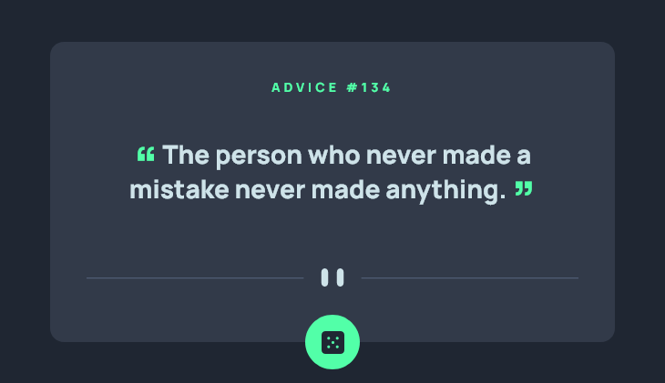

# Frontend Mentor - Advice generator app solution

This is a solution to the [Advice generator app challenge on Frontend Mentor](https://www.frontendmentor.io/challenges/advice-generator-app-QdUG-13db). Frontend Mentor challenges help you improve your coding skills by building realistic projects.

## Table of contents

- [Overview](#overview)
  - [The challenge](#the-challenge)
  - [Screenshot](#screenshot)
  - [Links](#links)
- [What I learned](#what-i-learned)

## Overview

### The challenge

Users should be able to:

- View the optimal layout for the app depending on their device's screen size
- See hover states for all interactive elements on the page
- Generate a new piece of advice by clicking the dice icon

### Screenshot



### Links

- Live Site URL: [Github Pages](https://alpe12.github.io/frontendMentor/advice-generator-app/)

## What I learned

Ignore cache on Fetch request:
```js
{ cache: "no-store" }
```

Sometimes the advice received from API has words between quotation marks. I made the main quotation marks bigger, colored and centered to differentiate:
```css
.card .advicetext::before,
.card .advicetext::after {
    display: inline;
    vertical-align: bottom;
    color: hsl(150, 100%, 66%);
    font-size: 2em;
    top: .2em;
    position: relative;
    line-height: 38px;
}
```
Animate the dice when a request is being made:
```css
.card .button .dice.animate {
    animation: rotate 800ms linear infinite;
}
```
```js
dice.classList.add('animate');
```