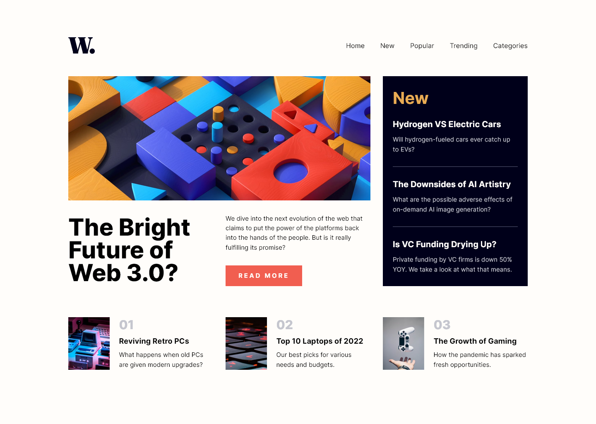
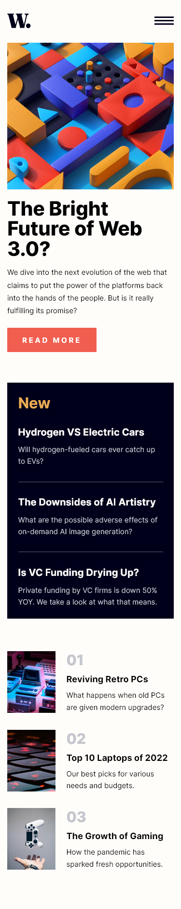
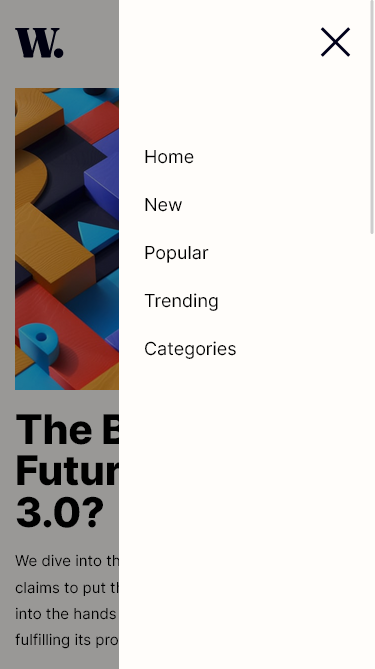

# Frontend Mentor - News homepage solution

This is a solution to the [News homepage challenge on Frontend Mentor](https://www.frontendmentor.io/challenges/news-homepage-H6SWTa1MFl). Frontend Mentor challenges help you improve your coding skills by building realistic projects. 

## Table of contents

- [Overview](#overview)
  - [The challenge](#the-challenge)
  - [Screenshot](#screenshot)
  - [Links](#links)
- [My process](#my-process)
  - [What I learned](#what-i-learned)


## Overview

### The challenge

Users should be able to:

- View the optimal layout for the interface depending on their device's screen size
- See hover and focus states for all interactive elements on the page

### Screenshot





### Links

- Live Site URL: [Github Pages](https://alpe12.github.io/frontendMentor/news-homepage/)

## My process

### What I learned

I wanted the padding to scale between two values, depending on the page width (also two values). After much research I was able to do it with this:

```css
--min-width: 681;
--max-width: 1440;
--min-padding-vertical: 22.5;
--max-padding-vertical: 90;
--min-padding-horizontal: 40;
--max-padding-horizontal: 165;
padding: 
    clamp(
        var(--min-padding-vertical)*1px,
        calc(var(--min-padding-vertical)*1px + (var(--max-padding-vertical) - var(--min-padding-vertical)) * ((100vw - var(--min-width)*1px) / (var(--max-width) - var(--min-width)))),
        var(--max-padding-vertical)*1px
    )
    clamp(
        var(--min-padding-horizontal)*1px,
        calc(var(--min-padding-horizontal)*1px + (var(--max-padding-horizontal) - var(--min-padding-horizontal)) * ((100vw - var(--min-width)*1px) / (var(--max-width) - var(--min-width)))),
        var(--max-padding-horizontal)*1px
    );
```

Learned how to add a counter with css.

```css
main .cards article {
    counter-increment: cardscount 1;
}

main .cards article .content .count::before {
    content: counter(cardscount, decimal-leading-zero);
}
```

Also learned more about how to use grid. Still a lot to learn though.