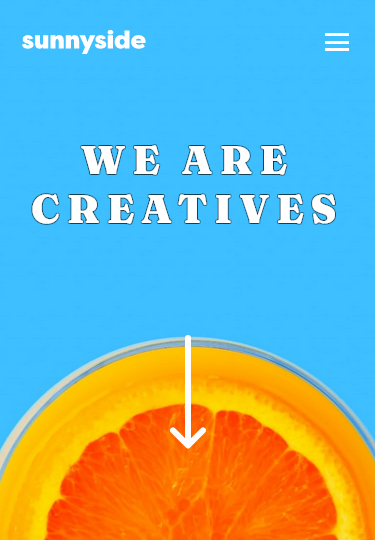

# Frontend Mentor - Sunnyside agency landing page solution

This is a solution to the [Sunnyside agency landing page challenge on Frontend Mentor](https://www.frontendmentor.io/challenges/sunnyside-agency-landing-page-7yVs3B6ef). Frontend Mentor challenges help you improve your coding skills by building realistic projects.

## Table of contents

- [Overview](#overview)
  - [The challenge](#the-challenge)
  - [Screenshots](#screenshots)
  - [Links](#links)
- [My process](#my-process)
  - [What I learned](#what-i-learned)

## Overview

### The challenge

Users should be able to:

- View the optimal layout for the site depending on their device's screen size
- See hover states for all interactive elements on the page

### Screenshots





### Links

- Live Site URL: [Github Pages](https://alpe12.github.io/frontendMentor/sunnyside-agency-landing-page/)

## My process

### What I learned

Make a simple HTML+CSS hamburger.
```html
<label class="hamburger" for="menu-toggle">
    <div class="line"></div>
    <div class="line"></div>
    <div class="line"></div>
</label>
```
```css
header .top-nav-bar label.hamburger .line {
    width: 100%;
    height: 3px;
    background-color: #FFF;
    transition: transform 0.1s ease;
}
header .top-nav-bar label.hamburger:hover .line {
    opacity: 0.7;
}
header .top-nav-bar #menu-toggle:checked~label.hamburger .line {
    transition-duration: 0.3s;
}
header .top-nav-bar #menu-toggle:checked~label.hamburger .line:nth-child(1) {
    transform: translateY(8px) rotate(45deg);
}
header .top-nav-bar #menu-toggle:checked~label.hamburger .line:nth-child(2) {
    opacity: 0;
}
header .top-nav-bar #menu-toggle:checked~label.hamburger .line:nth-child(3) {
    transform: translateY(-7px) rotate(-45deg);
}
```

In this particular project I opted to add the background image urls as css variables directly on the html, so that the client could easily change it or add more.
I also added a --bgColor variable to set a default background color of the element to be shown while the image is loading.
```html
<div class="bg" style="
    --bg:url(../images/desktop/image-gallery-sugarcubes.jpg);
    --bgMobile:url(../images/mobile/image-gallery-sugarcubes.jpg);
    --bgColor: rgb(255,124,120);
"></div>
```
```css
body .bg {
    background-color: var(--bgColor);
    background-image: var(--bg);
    background-repeat: no-repeat;
    background-size: cover;
    background-position: center;
}
```

I added a text border in some places. Because depending on the window size, the text was barely visible over the background image.
```css
body .text-border-black,
body .text-border-white * {
    text-shadow: 1px 0 var(--text-border-color), -1px 0 var(--text-border-color), 0 1px var(--text-border-color), 0 -1px var(--text-border-color), 1px 1px var(--text-border-color), -1px -1px var(--text-border-color), 1px -1px var(--text-border-color), -1px 1px var(--text-border-color);
}
body .text-border-black {
    --text-border-color: rgba(0, 0, 0, 0.3);
}
body .text-border-white {
    --text-border-color: rgba(255, 255, 255, 0.4);
}
```

Made the arrow bounce up and down.
```css
header .content .arrow {
    animation: moveUpDown 1.2s infinite ease;
}
@keyframes moveUpDown {
    0% {
        transform: translateY(0);
        opacity: 0.85;
    }
    50% {
        transform: translateY(20px);
        opacity: 1;
    }
    100% {
        transform: translateY(0);
        opacity: 0.85;
    }
}
```

Reduce border-radius on the testemonial photo on hover.
```css
main .testemonials .flex .testemonial .poster {
    border-radius: 50%;
    transition: border-radius 300ms ease;
}
main .testemonials .flex .testemonial .poster:hover {
    border-radius: 25%;
}
```